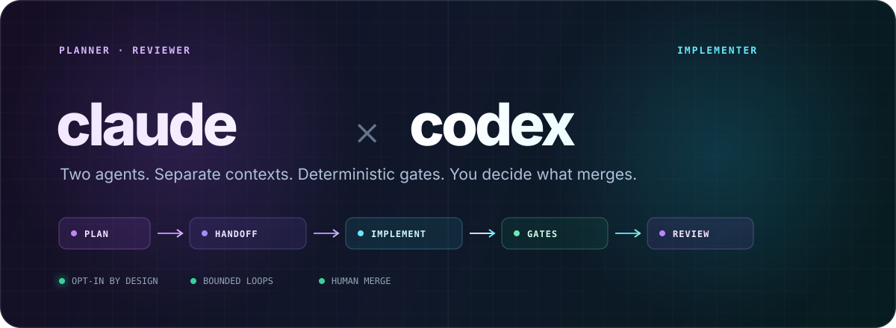

# claude-codex-pair

<p align="center">
  
</p>

<p align="center">
  <a href="https://github.com/hyj28/claude-codex-pair/actions/workflows/ci.yml"></a>
  <a href="https://github.com/hyj28/claude-codex-pair/releases/latest"></a>
  <a href="LICENSE"></a>
  <a href="https://www.gnu.org/software/bash/"></a>
  <a href="https://github.com/hyj28/claude-codex-pair/stargazers"></a>
</p>

<p align="center">
  <strong>Claude Code plans and reviews. Codex implements. Git is automated. You decide what merges.</strong>
</p>

<p align="center">
  <a href="#quick-start"><strong>Quick start</strong></a> ·
  <a href="#how-it-works">How it works</a> ·
  <a href="WORKFLOW.md">Design doc</a> ·
  <a href="CONTRIBUTING.md">Contributing</a> ·
  <a href="https://github.com/hyj28/claude-codex-pair/releases">Releases</a>
</p>

---

A lightweight, **opt-in** dual-agent development workflow for [Claude Code](https://claude.com/claude-code) + [Codex CLI](https://github.com/openai/codex).

| Claude Code | Deterministic gates | Codex |
|:--|:--|:--|
| Clarifies intent, writes the handoff, reviews in fresh context | Format, lint, typecheck, test integrity, and real run scenarios | Implements headlessly in an explicitly pinned workspace sandbox |

> [!NOTE]
> This is not a resident framework and it never auto-activates. Installing it changes
> nothing about normal Claude Code or Codex usage; the workflow exists only when you type
> `/pair` or `/pair-review`.

## Why pair them?

- **Context isolation:** the implementer never shares a conversation with the fresh,
  read-only reviewer.
- **Evidence over claims:** exit codes, test counts, test-diff integrity, and runtime
  scenarios decide whether a checkpoint is green.
- **Bounded autonomy:** fix and review loops stop after two rounds instead of spinning.
- **Human ownership:** the workflow can branch and commit, but merging, pushing, migrations,
  destructive changes, auth, payments, and breaking APIs stop with you.

## Quick start

Requirements: Claude Code CLI, Codex CLI, and git.

```bash
git clone https://github.com/hyj28/claude-codex-pair.git
cd claude-codex-pair
./install.sh
```

Then open Claude Code in any project:

```text
/pair Add CSV export with tests at the CLI boundary
/pair strict Add role-based access control
/pair-review codex base main
```

No framework, mandatory state machine, or manual context shuttling is involved. See
[WORKFLOW.md](WORKFLOW.md) for the complete design and safety boundaries.

## How it works

```
you: /pair <task>
 │
 ▼
Claude Code — clarifies (only if ambiguous), writes a short handoff:
              goal + constraints + acceptance criteria. No implementation details.
 │
 ▼
git checkout -b <slug>
 │
 ▼
Codex implements headlessly:
              codex exec -s workspace-write -c approval_policy=never - < handoff.md
 │
 ▼
Deterministic quality gates:  format → lint → typecheck → test
              exit codes decide — an agent's "tests pass" is never trusted
              + test count vs. the pre-handoff baseline (a suite that
                collected nothing also exits 0)
              + test-diff integrity (deleted assertions, new mocks,
                tautological expectations = red gate)
              + it actually runs: a fresh subagent that never saw the diff
                drives the program through the scenarios agreed before the
                handoff — or records why there was nothing to run
 │  fail → codex exec -s workspace-write ... resume --last "<failure output>"  (max 2 rounds)
 ▼
gates green → commit the implementation
 │
 ▼
Fresh-context, read-only Claude subagent reviews the diff
 │  (judges the tests too — a tautological or mocked-out test is a defect)
 │  findings → codex exec -s workspace-write ... resume --last "<findings>"     (max 2 rounds)
 │  each round: gates green → commit
 ▼
Report to you: commits, diffstat, gate results, review outcome.
Merge / push / PR: always your call.
```

Key mechanics:

- **No manual context shuttling** — the handoff goes to Codex via stdin; fix rounds use `codex exec resume --last`, which keeps Codex's full session context so only incremental feedback is sent.
- **Implementer/reviewer isolation** — the reviewer is a fresh subagent with read-only tools; it shares no conversation history with the planner and cannot "helpfully" edit code.
- **The gate proves more than "green"** — a passing suite only shows nothing already-working broke. The gate also asserts the test count held against a baseline taken *before* the handoff, and that the diff didn't buy its green by deleting assertions, mocking out the thing under test, or writing expectations that recompute the code's own answer. New behavior with a flat test count is a red gate. The handoff asks for tests at named **seams**, and the strict profile stashes the implementation to confirm the new tests actually fail without it.
- **Somebody actually runs it** — compiling and passing tests still leaves "crashes on launch" unchecked, so a fourth gate starts the program and walks the scenarios written down before any code existed. The driver is a fresh subagent that is deliberately not shown the diff — having read the implementation is what stops you from behaving like a user. It reports a table of command, verbatim output, expected, match/mismatch; "ran it, works" is refused. Nothing to run? The gate resolves to a substitute surface (a throwaway consumer of the named seam) or to *not applicable* with a stated reason — and "the tests cover it" is not one of the reasons.
- **Bounded loops** — fix/review cycles cap at 2 rounds each, then stop and report.
- **A commit per gated step** — Claude Code commits (never Codex) each time the gates go green: one for the implementation, one per review round. The branch keeps a readable trail and is meant to be merged as-is, no squashing or history surgery.
- **Dependencies, tiered** — Codex sets up the project's own environment and installs its declared dependencies (repo-local only, with the package-manager cache dirs granted explicitly). Anything system-level — `brew`, global installs, `sudo`, new runtimes, containers — stops and asks; the sandbox denies it anyway, and approvals are off, so it can't be escalated.
- **Human gates** — merges, migrations, data deletion, auth/payment logic, and breaking API changes always stop and ask, regardless of profile.

## Commands

| Command | When | What runs |
|---|---|---|
| *(nothing)* | Small edits, questions | Normal Claude Code / Codex chat — the workflow doesn't exist until invoked |
| `/pair fast <task>` | Small task, but let Codex do it | One-paragraph instruction → Codex → gates → commit |
| `/pair <task>` | Medium feature (default: standard) | Handoff doc → branch → Codex → gates → read-only review loop → commit |
| `/pair strict <task>` | Risky / complex change | Standard + human plan approval + dual review (Claude subagent **and** `codex exec review`) |
| `/pair-review` | Just want a second pair of eyes | Fresh read-only subagent reviews uncommitted changes; add `codex` to also run Codex's native review, `base <branch>` to review a branch diff |

## Install

Requirements: Claude Code CLI, Codex CLI, git. (`gh` optional, only for the auto-PR extension.)

```bash
./install.sh          # copies skills/ into ~/.claude/skills/
```

Or manually:

```bash
cp -R skills/pair skills/pair-review ~/.claude/skills/
cp WORKFLOW.md ~/.claude/skills/pair/
```

Then `/pair` and `/pair-review` are available in every project. Installing changes nothing about normal usage — the skills explicitly refuse to auto-activate and only run when you type the command.

## License

[MIT](LICENSE)
